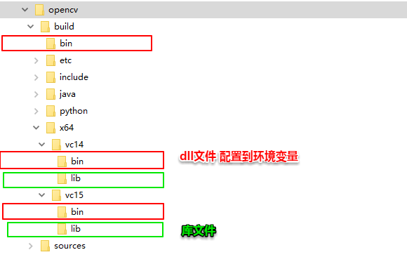
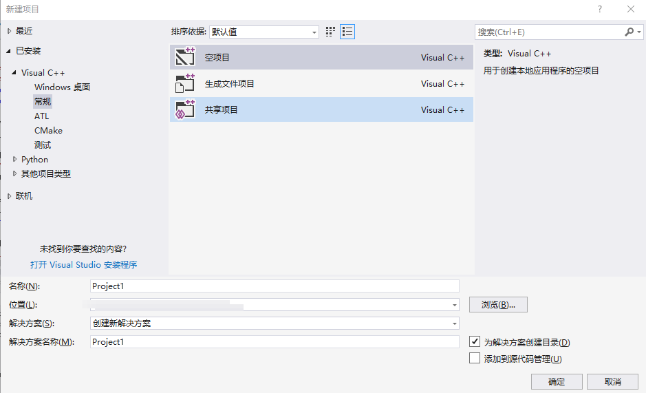
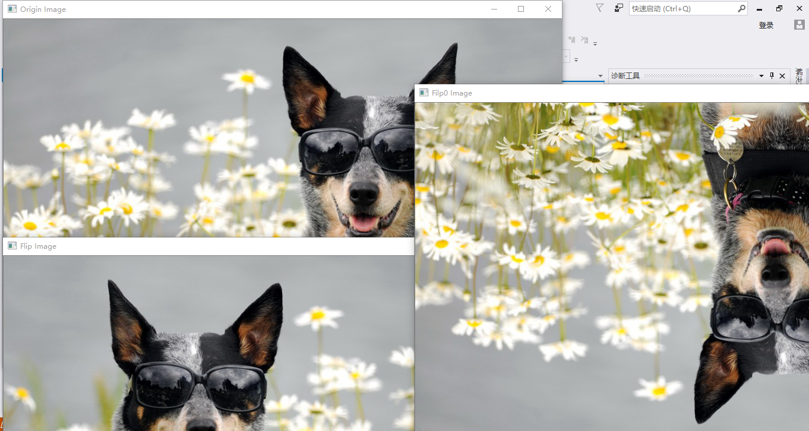

opencv安装
----
1. 下载opencv3.4: <https://opencv.org/releases.html>
2. 安装opencv
  > c盘安装最好以管理员权限执行，个人出现了文件不显示的情况
3. 目录结构:如下 
4. 配置环境变量: 红色bin目录:
  - C:\Program Files\opencv\build\bin
  - C:\Program Files\opencv\build\x64\vc14\bin
  - C:\Program Files\opencv\build\x64\vc15\bin

> ipp是intel加速opencv的库文件，可选安装，此处做记录，方便以后用到查找 http://registrationcenter-download.intel.com/akdlm/irc_nas/1327/w_ipp_ia32_p_6.0.2.074.exe


vs2017安装以及opencv开发配置
----
1. vs2017下载: <https://www.visualstudio.com/zh-hans/downloads/>
2. 按需求选择安装c++环境: 等待下载安装完成
3. 创建项目: 文件->新建->项目>Visual C++->常规->空项目->配置目录及名称->确定
  
4. 创建HelloWorld.cpp: ctrl+N->新建文件->Visual C++->C++ 文件(.cpp)->打开，输入代码， 保存为helloWorld.cpp到工程目录
  ``` c++
  #include<iostream>  
  int main()
  {
  	std::cout << "Hello world\n";
  	return 0;
  }
  ```
5. 添加cpp到源文件: 解决方案资源管理器->(你的项目名称)->源文件->右键->添加->现有项-> 选择HelloWorld.cpp->添加
6. 本地windows调试器: 如果正常，命令行界面出现 Hello world 一闪而过
7. 配置 opencv:
  1. 修改配置属性(** visual2017的正上方用于选择配置，此时需要选择Debug x64**): 属性管理器->项目名称-> Debug|x64(如果是32位机器选择32) -> 右键 -> 属性
    > 本人小白，暂时理解为： 工程在不同环境下配置不同环境, Debug模式 与 Release模式不同, 32 还是 64 与机器有关。
  2. VC++ 目录->包含目录: 添加目录  
    > C:\Program Files\opencv\build\include\opencv2  
    > C:\Program Files\opencv\build\include\opencv  
    > C:\Program Files\opencv\build\include
  3. VC++ 目录->库目录: 添加目录  
    > C:\Program Files\opencv\build\x64\vc14\lib
    > C:\Program Files\opencv\build\x64\vc15\lib
  4. 链接器->输入->附加依赖项: 添加  
    > opencv_world340d.lib  
    > ** 注意: ** 此处的 340 表示opencv版本， d 表示 debug，如果你是Release 应该不需要 d，个人猜测。
8. 配置完成，修改HelloWorld.cpp:
  ``` c++
  #include <opencv2/opencv.hpp> //包含头文件
  #include <iostream>    
  using namespace cv;      //使用命名空间cv，下面的cv::line等的前缀可以不写
  using namespace std;    //使用命名空间std，可以调用C++标准库里面的函数或类
  int main(int argc, char** argv) {    //argc 表示命令行输入参数的个数（以空白符分隔），argv中存储了所有的命令行参数
  	Mat src = imread("path\\to\\dog.jpg");     //载入图像
  	if (src.empty()) {                    //是不是为空
  		printf("could not load image...\n");
  		return -1;
  	}
  	Mat flip_image;
  	Mat flip0_image;
  	flip(src, flip0_image, 0);                         // 翻转图片 >0水平；==0垂直
  	flip(src, flip_image, 1);
  	// namedWindow("Flip Image", CV_WINDOW_AUTOSIZE);  //创建窗口，自动大小
  	imshow("Origin Image", src);                      //显示图像
  	imshow("Flip Image", flip_image);                 //显示水平翻转图像
  	imshow("Filp0 Image", flip0_image);               //显示垂直翻转图像
  	imwrite("path\\to\\dog1.jpg", flip_image);  // 图片写入文件
  	waitKey(0);                                     //x=0无限等待下去，直到有按键按下
  	return 0;
  }
  ```
9. 本地windows调试: 
